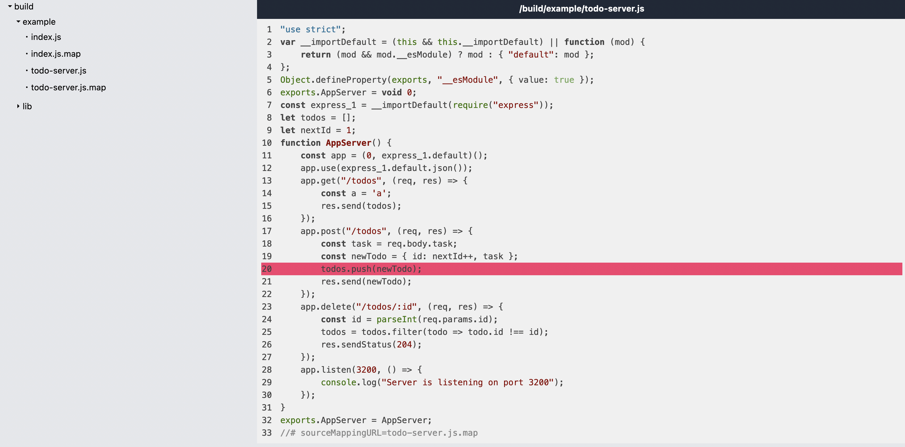
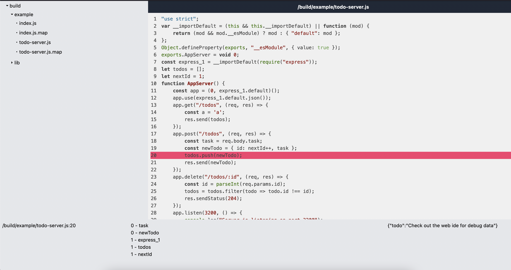

# Summary
Purple bird is a project I've done over the weekend to explore nodejs remote debugging capabilities.
it uses the V8 inspector runtime api together with a suite of communication protocols to allow debugging from anywhere<sup>1</sup>

There is a lot to be done and it's not perfect, but it was an insightful weekend. 


[1] After some changes, as this was only tested on localhost

# Features
* Set non-breaking breakpoints (Boints) on any line of your code
* locally run web-ide to display variables at the scope of the boints

# Screenshots



# Running the examples
This guide is made for unix based machines, if you are using windows make sure you use a unix cli emulator such as the git bash

Start by cloning the repository, and installing dependencies:
```bash
git clone https://github.com/matan1905/purple-bird.git && cd purple-bird && npm install
```

Then you will need to run the debugging interface.
make sure you run it from the root of the Purple bird repository:
```bash
npm run build # building the example project 
cd web-ide 
npm install # installing dependencies
PROJECT_DIR=$(pwd)/../build npm run dev # running the web ide
```
The Web IDE should now be available over at: http://localhost:3000

The next step would be to run the example todo server. it is already loaded with purple-bird sdk.
you can see it over at /src/examples/todo-server.ts
```bash
cd .. 
npm run example # running the example project
```

This will show you the file system of the resulting build process, where you can put any breakpoint you would like, and it will display you the debugging  information.

For example, in the web ide, you can go to /build/example/todo-server.js and place a Boint on line 20, after that you can go ahead and run the following curl which adds a todo:
```bash
curl --request POST \
  --url http://localhost:3200/todos \
  --header 'Content-Type: application/json' \
  --data '{
	"task": {
		"todo":"Check out the web ide for debug data"
	}
}'
```
and return to the web ide to see it.

# Todo
This project was done over the span of a weekend, there is a lot of missing parts and probably many bugs.
but this is the gist of what's left to do:
- [ ] Proper testing to see how it behaves beyond the examples
- [ ] Allow typescript sources directly by converting line numbers
- [ ] Review code for bad practices and implementing better ones
- [ ] Wrap V8 Inspector with an async equivalent for better readability
- [ ] Rework the architecture, create a dedicated relay server
